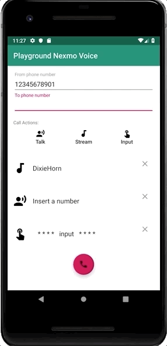

# Android-Voice-Api-Playground
An Android app to build a simple [NCCO(Nexmo Call Control Object)](https://developer.nexmo.com/voice/voice-api/ncco-reference) and create an outgoing phone call.


## Set up
To run this project you'll have to create a Nexmo Apllication, and authenticate your network calls with your JWT.
There are a few ways to accomplish it. 

To do that without your server side supprt, here are instructions to do it with Nexmo CLI:

1. If you don't already have one, setup a [Nexmo account]((https://dashboard.nexmo.com/).


2. Use [npm](https://www.npmjs.com/) to install and setup the Nexmo CLI:
```.sh
$ npm install nexmo-cli -g
```

3. Set up Nexmo CLI with your API_KEY and API_SECRET, which can be found on [Nexmo dashboard](https://dashboard.nexmo.com/getting-started-guide)

```.sh
$ nexmo setup <API_KEY> <API_SECRET>
```

4. Create a new Nexmo Voice Application, and generate locally a private key file:

```.sh
$ nexmo app:create "My Nexmo App" http://example.com/answer http://example.com/event --type=voice --keyfile=private.key
```

In the output of that command you'll find the ID of the generated app. Take a note of it.

5. Create a [JSON Web Token (JWT)](https://jwt.io/). Make sure to replace MY_APP_ID with the Nexmo Application Id generated on previous step.
in this example the JWT will expire in 1 day from the moment it was generated.

```.sh
nexmo jwt:generate ./private.key exp=$(($(date +%s)+86400)) acl='/**' application_id=MY_APP_ID
```

The output will give you a JWT. Copy it.

After opening this project in Android Studio, open `NexmoApiService.kt` file, paste your JWT as the value of `const val APP_JWT`

Now you'll be able to make authenticated network calls.


## How to use this app?

After running the app:
 
* Insert the phone number you'd like to call to. 

* Click on Talk, Stream or Input buttons to add an action to the NCCO.

* When you're ready, click the Call button below to place the call. (notice: the calls will be charged on your Nexmo account credit) 





### Read more about [Nexmo Voice API](https://developer.nexmo.com/voice/voice-api/overview)


